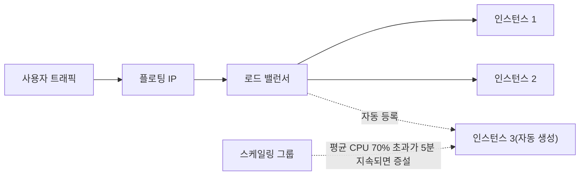

# 트래픽 변동에 맞춰 인스턴스를 자동으로 늘리고 줄이기

## 시작하기 전에

Auto Scale은 인스턴스의 부하를 모니터링해 인스턴스를 자동으로 생성하거나 삭제하는 서비스입니다. 어떤 조건에서 몇 대를 늘리고 줄일지, 늘어날 인스턴스를 어떤 구성으로 만들지를 **스케일링 그룹** 하나에 정의하면 Auto Scale이 그 정의에 따라 인스턴스 수를 조절합니다.

트래픽이 시간대나 이벤트에 따라 크게 변하는 서비스에서 피크에 맞춰 인스턴스를 상시 확보하면 한가한 시간대의 비용이 낭비됩니다. 반대로 평시 기준으로 맞춰 두면 트래픽이 몰릴 때 운영자가 직접 인스턴스를 늘려야 하고, 대응이 늦어지는 만큼 응답이 지연됩니다.

이 가이드를 따라하면 로드 밸런서 뒤에 웹 서버 인스턴스를 두고, CPU 사용률에 따라 인스턴스가 자동으로 늘고 주는 것을 직접 확인할 수 있습니다.




## 시나리오 환경 구성

- 인스턴스를 만들 VPC와 서브넷이 있어야 합니다. 이 가이드는 `myvpc2`의 `mysubnet2 (192.168.0.0/24)`를 사용합니다.
- 로드 밸런서와 인스턴스는 **같은 서브넷**에 생성해야합니다. 
- 인스턴스에 사용할 이미지, 인스턴스 타입, 키페어를 준비합니다. 이 가이드는 Ubuntu Server 22.04 LTS 이미지와 `m2.c1m2`(1vCPU, 2GB)를 사용합니다.
- 스케일링 그룹에 로드 밸런서를 연결하려면 Infrastructure Load Balancer ADMIN 또는 Infrastructure ADMIN 권한이 필요합니다.

> [!NOTE]
> 스케일링 그룹 구성 자체는 과금되지 않지만, 스케일링 그룹이 생성한 인스턴스와 로드 밸런서, 플로팅 IP는 만들어지는 순간부터 과금됩니다.


## 로드 밸런서 만들기

1. **Network > Load Balancer**를 클릭한 다음 **로드 밸런서 생성**을 클릭하세요.
2. **모드 선택**에서 **L4 라우팅**을 선택하고 **확인**을 클릭하세요.
3. **설정**에서 기본 정보를 입력합니다.

- **이름**: `lb-autoscale`을 입력합니다. 80자 이내의 영문자와 숫자, `-`, `_`, `.`만 사용할 수 있습니다.
- **타입**: **일반**을 선택합니다.
- **서브넷**: `mysubnet2 (192.168.0.0/24)`를 선택합니다.

1. **리스너**와 **멤버 그룹**은 기본값을 그대로 사용합니다. 리스너는 `HTTP` 프로토콜의 `80` 포트로 요청을 받고, 멤버 그룹은 `ROUND_ROBIN` 방식으로 멤버의 `80` 포트에 분산합니다. 상태 확인은 `HTTP`로 `GET /`를 호출해 `200`이 오는지 30초마다 확인합니다.

> [!WARNING]
> **상태 확인 포트는 앞에서 보안 그룹에 수신 허용한 포트와 같아야 합니다.** 이 가이드는 둘 다 80입니다. 다르면 증설된 인스턴스가 멤버로 등록만 되고 트래픽을 받지 못합니다.

1. **멤버 목록**은 비워 둡니다. 스케일링 그룹이 만든 인스턴스가 자동으로 등록됩니다.
2. **로드 밸런서 생성**을 클릭하세요.


## 플로팅 IP 연결하기

로드 밸런서는 사설 IP만 가지므로 외부에서 접근할 수 없습니다. 플로팅 IP를 연결하면 그룹 전체에 트래픽을 보낼 수 있고, 동작을 확인할 때도 이 주소를 사용합니다.

1. 위에서 생성한 `lb-autoscale`가 ACTIVE 상태가 되면 체크박스를 선택한 후 **플로팅 IP 관리**를 클릭하세요.
2. **플로팅 IP 생성**의 **생성**을 클릭합니다. **IP 풀**은 `Public Network`를 그대로 두고 **레이블**에 `asguide`를 입력한 다음 **생성**을 클릭하세요.

> [!NOTE]
> 레이블은 64자 이내의 **영문자 또는 숫자만** 입력할 수 있습니다. 인스턴스 이름과 달리 `-`와 `.`은 쓸 수 없습니다.

1. **플로팅 IP 연결/해제**에서 방금 만든 IP를 선택하고, **네트워크 인터페이스 선택**에 `lb-autoscale`이 지정된 것을 확인한 다음 **연결**을 클릭하세요.

> [!NOTE]
> 연결한 플로팅 IP는 로드 밸런서 목록의 **IP 주소** 열에 표시되지 않습니다. 이 열은 사설 IP만 보여 주므로 연결 결과는 **Network > Floating IP**의 **연결된 장치** 열에서 확인합니다.


## 스케일링 그룹 만들기

**Compute > Auto Scale**을 클릭한 다음 **스케일링 그룹 생성**을 클릭하세요.

1. **인스턴스 템플릿**에서 **사용 안 함**을, **OS 설정**에서 **신규 생성 및 설정**을 선택합니다.
2. **이미지** 영역에서 공용 이미지 중 `Ubuntu Server 22.04 LTS`를 선택합니다.
3. **루트 블록 스토리지**에서 타입 **HDD**, 크기 `20`GB를 지정합니다.
4. **기본 정보 설정**의 **인스턴스 정보**를 입력합니다.

- **가용성 영역**: **임의의 가용성 영역**을 선택합니다. 
- **인스턴스 이름**: `as-web`을 입력합니다.
- **인스턴스 타입**: `m2.c1m2`를 선택합니다. 증설 단위가 되는 크기이므로, 한 대를 크게 잡기보다 작은 타입을 여러 대 늘리는 편이 부하 변화에 촘촘하게 대응합니다.
- **키페어**: 증설된 인스턴스에 접속해 상태를 확인하려면 필요합니다.

1. **추가 설정**의 **네트워크**에서 **사용 가능한 서브넷**인 `mysubnet2 (192.168.0.0/24)`를 클릭합니다. 로드 밸런서와 같은 서브넷이어야 합니다.
2. 보안 그룹에서 보안 그룹 생성을 클릭합니다.

- **이름**: `sg-autoscale-web`을 입력합니다.
- **보안 규칙 추가**에서 `+`를 두 번 클릭해 규칙 행을 두 개 추가하고 다음과 같이 입력합니다. 추가한 행의 기본값이 **수신 / 사용자 정의 TCP / IPv4 / CIDR**이므로 포트와 원격 주소만 채우면 됩니다.
  - **80 /** `192.168.0.0/24`: 로드 밸런서가 보내는 상태 확인과 서비스 트래픽을 허용합니다.
  - **22 /** `192.168.0.0/24`: 같은 VPC 안에서 SSH로 접속할 때 사용합니다.
  원격에 서브넷 대역을 지정하면 로드 밸런서의 요청은 통과하면서 인터넷에서 인스턴스로 직접 들어오는 요청은 차단됩니다.
  입력을 마친 다음 **확인**을 클릭하세요.

1. **사용자 스크립트**의 **설정 변경**을 클릭하고 다음 스크립트를 입력하세요.

```bash
#!/bin/bash
# 1) 웹 서버 기동 - 로드 밸런서 상태 확인(GET / → 200)에 응답
export DEBIAN_FRONTEND=noninteractive
apt-get update -qq
apt-get install -y -qq nginx
systemctl enable --now nginx

# 2) CPU 부하 - vCPU 수만큼 무한 루프를 띄우고 900초 뒤 자동 종료
for i in $(seq $(nproc)); do
  setsid nohup timeout 900s bash -c 'while :; do :; done' >/dev/null 2>&1 </dev/null &
done
```

사용자 스크립트는 인스턴스가 처음 부팅될 때 root 권한으로 한 번 실행됩니다. 

> [!WARNING]
> 사용자 스크립트는 **실패해도 콘솔에 오류가 표시되지 않습니다.** 설치되지 않은 패키지를 기동하거나 명령 경로가 틀려도 인스턴스는 정상 생성된 것으로 보이고, 로드 밸런서 멤버만 `INACTIVE`로 남습니다.

> [!NOTE]
> 2번 블록은 확인용이므로 운영에 투입하기 전에 반드시 삭제하세요.


## 스케일링 정책 설정하기

**스케일링 그룹 설정**부터가 자동 확장과 감축 규칙입니다. 조건은 개별 인스턴스가 아니라 **그룹에 속한 모든 인스턴스의 평균값**으로 1분마다 평가됩니다.

1. **스케일링 그룹 정보**에서 그룹의 규모를 정합니다.

- **이름**: `as-web-guide`를 입력합니다. 32자 이내의 영문자와 숫자, `-`, `.`만 사용할 수 있습니다.
- **최소 인스턴스**: `2`를 입력합니다. 감축이 일어나도 이 수 아래로는 줄지 않습니다.
- **최대 인스턴스**: `3`을 입력합니다. 1100 범위이며 최소 인스턴스보다 크거나 같아야 합니다. 비용 상한을 정하는 값이기도 합니다.
- **구동 인스턴스**: `2`를 입력합니다. 그룹 생성 직후 만들어질 수이며 최소와 최대 사이여야 합니다.

1. **증설 정책**의 **조건**에서 두 번째 드롭다운의 `cpu`를 그대로 두고, 임계값에 `70`(%), 지속 시간에 `5`(분)을 입력합니다. 평균 CPU 사용률이 70%를 넘는 상태가 5분 이어지면 증설됩니다. 지속 시간을 두는 이유는 순간적으로 튀는 사용률에 반응해 불필요한 인스턴스를 만들지 않기 위해서입니다.
2. **인스턴스 조정**에 `1`, **재사용 대기 시간**에 `5`(분)을 입력합니다. 재사용 대기 시간은 인스턴스를 생성한 뒤 추가 생성을 시도하지 않는 시간입니다. 새 인스턴스가 부팅되고 트래픽을 나눠 받기까지 걸리는 시간보다 짧게 잡으면 증설 효과가 나타나기 전에 증설이 연달아 일어납니다.
3. **감축 정책**에 임계값 `30`(%), 지속 시간 `5`(분), 인스턴스 조정 `1`개, 재사용 대기 시간 `5`분을 입력합니다. 감축의 재사용 대기 시간은 인스턴스를 **삭제한 뒤 추가 삭제를 시도하지 않는** 시간입니다.
4. **자동 복구 정책**에서 **사용 안 함**을 선택합니다.
5. **로드 밸런서**의 **사용 가능한 로드 밸런서**에서 `lb-autoscale`을 클릭하세요.
6. **스케일링 그룹 생성**을 클릭하세요. **구동 인스턴스**에 입력한 수만큼 인스턴스가 자동으로 생성되고, 그 시점부터 인스턴스 요금이 부과됩니다.


## 동작 확인하기

스케일링 그룹은 조건이 충족되기 전까지 아무 변화가 없으므로, 부하를 준 상태에서 인스턴스 수가 실제로 변하는지 확인합니다. 전체 확인에 약 35분이 걸립니다.

1. 그룹을 선택하고 **인스턴스 목록** 탭에서 구동 인스턴스가 만들어졌는지 확인하세요. 상태가 `CREATE_IN_PROGRESS`에서 `CREATE_COMPLETE`로 바뀌기까지 4분쯤 걸립니다.

> [!NOTE]
> 자동 생성된 인스턴스는 이름이 모두 같으므로 **인스턴스 ID**로 구분합니다.

1. 로드 밸런서 멤버가 정상인지 확인하세요. **Network > Load Balancer**에서 `lb-autoscale`을 선택하고 **멤버 그룹**의 바로가기 아이콘을 클릭한 다음, 멤버 그룹을 선택하고 **멤버** 탭에서 상태가 `ACTIVE`인지 봅니다.

> [!NOTE]
> **이 단계를 통과해야 트래픽이 분산됩니다.** 증설과 감축은 CPU 지표만으로 판단하므로 멤버가 `INACTIVE`여도 인스턴스 수는 정상적으로 늘고 줍니다. 인스턴스 수만 보고 있으면 문제를 놓칩니다. `ACTIVE`가 되지 않으면 인스턴스 안에서 웹 서버가 떠 있는지, 보안 그룹이 상태 확인 포트를 허용하는지 확인하세요.

1. 플로팅 IP로 접속해 서비스가 응답하는지 확인하세요.

```bash
curl http://{플로팅 IP}/
```

정상 멤버가 없으면 `HTTP 503`이, 멤버가 `ACTIVE`가 되면 웹 서버의 응답이 돌아옵니다.

1. 증설을 확인합니다. 10분이 지나면 **인스턴스 목록**에 총 3대의 인스턴스가 생성된 것을 확인합니다.
2. 약 35분이 지난 후 감축을 확인합니다. **최소 인스턴스인 2대까지만** 줄어듭니다.


## 응용하기

- **CPU 외 지표로 판단하기**: 조건의 지표는 `cpu` 외에 `memory`, `disk.read.bps`, `disk.write.bps`, `network.rx.bps`, `network.tx.bps`를 선택할 수 있습니다. 정적 파일을 많이 내려보내는 서비스처럼 CPU보다 네트워크 전송량이 먼저 한계에 닿는다면 `network.tx.bps`가 더 정확한 기준입니다.
- **조건을 두 개 이상 조합하기**: **조건 추가**를 클릭해 조건을 추가하고 **조건 연산자**에서 **AND** 또는 **OR**를 선택합니다. CPU 70% 초과와 메모리 80% 초과를 **AND**로 묶으면 한 지표만 튀었을 때의 증설을 막을 수 있고, **OR**로 묶으면 어느 한쪽만 한계에 닿아도 증설합니다.
- **예정된 트래픽에 미리 대비하기**: 이벤트 시작 시각처럼 트래픽이 늘어날 시점을 알고 있다면 지표 조건만으로는 증설이 트래픽보다 늦습니다. 스케일링 그룹 상세의 **예약 작업**에서 **최소 인스턴스**, **최대 인스턴스**, **구동 인스턴스** 중 하나를 골라 지정한 시각에 변경할 수 있습니다. **반복**에서 **Cron 표현식**을 선택하면 되풀이되는 일정으로 등록됩니다. 이 버튼은 스케일링 그룹 생성이 완료되기 전까지 비활성 상태입니다.


## 정리하기

확인용으로 만든 리소스는 사용을 마치면 삭제하세요. 인스턴스와 로드 밸런서, 플로팅 IP는 그대로 두면 계속 과금됩니다.

1. **Compute > Auto Scale**에서 스케일링 그룹을 체크하고 **스케일링 그룹 삭제**를 클릭하세요. 그룹이 만든 인스턴스와 로드 밸런서 멤버 등록도 함께 정리됩니다.
2. **Network > Floating IP**에서 **연결 해제**를 클릭한 다음 **플로팅 IP 삭제**를 클릭하세요. 플로팅 IP는 연결하지 않아도 과금됩니다.
3. **Network > Load Balancer**에서 **로드 밸런서 삭제**를 클릭하세요.

계속 운영할 구성이라면 사용자 스크립트에서 CPU 부하 블록을 삭제하고, 자동 복구 정책을 **사용**으로 되돌리세요.

## 용어 정리


| 용어       | 설명                                                                   |
| -------- | -------------------------------------------------------------------- |
| 오토스케일    | 인스턴스의 부하, 장애 여부를 모니터링하여 필요한 경우 인스턴스를 추가로 생성하거나 삭제하는 기능               |
| 스케일링 그룹  | Auto Scale 서비스에서 인스턴스를 추가로 생성 또는 삭제하는 조건과, 조건이 만족하는 경우 수행할 행동을 정의한 것 |
| 인스턴스     | 가상의 CPU, 메모리, 기본 디스크로 구성된 가상 서버                                      |
| 로드 밸런서   | 인스턴스의 트래픽 부하 분산 기능을 제공하는 서비스                                         |
| 멤버 그룹    | 로드 밸런서가 트래픽을 분산할 대상 인스턴스의 묶음과 상태 확인 규칙을 정의한 것                        |
| 상태 확인    | 로드 밸런서가 멤버 인스턴스에 주기적으로 요청을 보내 정상 동작 여부를 판단하는 기능                      |
| 가용성 영역   | 독립된 전원 및 네트워크를 갖춘 데이터 센터로, 인스턴스가 만들어지는 물리적인 위치                       |
| 서브넷      | IP 네트워크를 더 작은 단위로 세분화한 IP 주소 영역                                      |
| 보안 그룹    | 인스턴스의 송수신 트래픽을 제어하는 기능                                               |
| 플로팅 IP   | 외부 네트워크와 통신할 수 있도록 별도 요청을 통해 지정된 네트워크로부터 할당 받는 IP 주소                 |
| 사용자 스크립트 | 인스턴스가 처음 부팅될 때 한 번 실행되는 스크립트                                         |
| 확장       | Auto Scale 서비스에서 구동 인스턴스 수를 늘리는 것                                    |
| 감축       | Auto Scale 서비스에서 구동 인스턴스 수를 줄이는 것                                    |


---


## 🔍 작성자 메모

**이 섹션은 게시 시 삭제합니다.**

본문의 모든 절차와 값은 2026-09-21 한국(판교) 리전에서 실제로 구성해 확인했습니다. 증설은 부팅 완료 후 6분, 감축은 부하 해제 후 7분에 발동했고 멤버 3대 모두 `ACTIVE`였습니다. 보안 그룹은 `수신 TCP 80 / 192.168.0.0/24`만으로 상태 확인이 통과했으며, 플로팅 IP가 없는 인스턴스도 `apt-get install`이 동작했습니다.

남은 확인 항목입니다.

- [ ] 다이어그램 작성 후 Mermaid 코드 블록과 청사진 안내 어드모니션 삭제
- [ ] 작성한 다이어그램 이미지가 사내 디자인 규격을 따르는지 확인