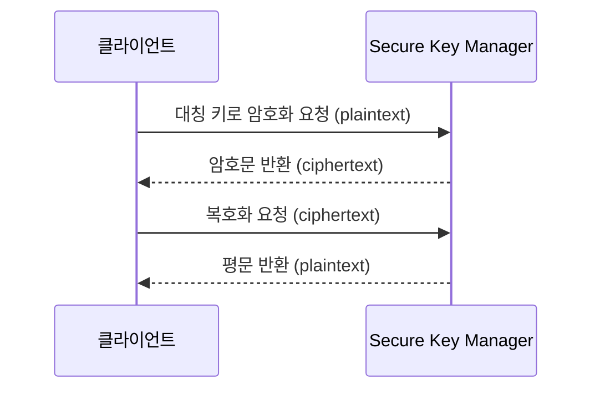

# Secure Key Manager로 암호화 키 관리하기

## 시작하기 전에

암호화는 원본 데이터(평문)를 암호화 키로 변환하여, 키가 없으면 읽을 수 없는 형태(암호문)로 만드는 과정입니다. 암호화의 안전성은 키의 보호 수준에 따라 결정됩니다. 키가 노출되면 누구나 데이터를 복호화할 수 있기 때문입니다. 코드나 설정 파일에 평문으로 남아서는 안 되는 민감 데이터는 별도의 안전한 저장소에서 체계적으로 관리해야 합니다.

Secure Key Manager는 NHN Cloud에서 제공하는 키 관리 서비스입니다. 대칭 키(AES256), 비대칭 키(RSA2048), 기밀 데이터를 안전하게 저장하고, IP 주소·MAC 주소·클라이언트 인증서 기반의 접근 제어로 허용된 환경에서만 키를 사용할 수 있도록 보호합니다. 키 교체(회전) 주기를 설정하면 자동으로 새 버전의 키가 생성되므로, 코드 변경 없이 보안을 유지할 수 있습니다.

여기에서는 Secure Key Manager에서 키 저장소를 만들고, 대칭 키를 등록한 뒤, API로 데이터를 암·복호화하는 방법을 살펴봅니다. Secure Key Manager의 다양한 기능에 대한 자세한 설명은 [Secure Key Manager 사용자 가이드](https://docs.nhncloud.com/ko/Security/Secure%20Key%20Manager/ko/overview/)를 참고하세요.



## 시나리오 환경 구성

- NHN Cloud 콘솔에서 Secure Key Manager 서비스가 활성화되어 있어야 합니다. 활성화 방법은 [프로젝트 서비스 활성화 가이드](https://docs.nhncloud.com/ko/nhncloud/ko/console-guide/#_21)를 참고하세요.
- 이 가이드는 Secure Key Manager API v1.3을 기준으로 설명합니다. Secure Key Manager API v1.3은 API 호출 및 인증을 위한 인증 방법으로 Appkey, 프로젝트 통합 Appkey, User Access Key 토큰을 지원합니다. 각 인증 방법의 확인 및 사용에 대한 자세한 내용은 [Appkey](https://docs.nhncloud.com/ko/nhncloud/ko/public-api/appkey/), [프로젝트 통합 Appkey](https://docs.nhncloud.com/ko/nhncloud/ko/public-api/project-integrated-appkey/), [User Access Key 토큰](https://docs.nhncloud.com/ko/nhncloud/ko/public-api/user-access-key-token/)을 참고하세요.
- API를 호출할 클라이언트의 IPv4 주소를 미리 파악합니다. Secure Key Manager는 등록된 IP에서만 API 호출을 허용하므로, 호출 환경의 공인 IP를 알고 있어야 합니다.
- API 호출을 위해 `curl`이 설치된 터미널 환경이 필요합니다.

### 키 저장소 생성하기

키 저장소는 암호화 키와 접근 제어 정보를 묶어서 관리하는 단위입니다. 키를 등록하기 전에 먼저 키 저장소를 만들어야 합니다.

1. NHN Cloud 콘솔에서 **Security > Secure Key Manager**를 클릭하세요.

2. **키 저장소** 탭에서 **+** 버튼을 클릭하세요.

3. **키 저장소 추가** 대화 상자에서 다음 항목을 입력합니다.
    - **이름**: 키 저장소를 식별할 이름을 입력합니다. 예: `prod-encryption-store`
    - **설명**: 키 저장소의 용도를 적습니다. 운영 환경에서 여러 키 저장소를 구분하기 위해 사용합니다.
    - **인증 방법**: 키 저장소에 접근할 클라이언트의 인증 방법을 선택합니다. 인증을 통과한 클라이언트만 키를 사용할 수 있습니다. **IPv4 주소**, **MAC 주소**, **클라이언트 인증서** 중 하나 이상을 선택합니다. 공인 IP가 고정된 서버 환경이라면 **IPv4 주소**, 물리 장비를 특정해야 하는 온프레미스 환경이라면 **MAC 주소**, 서버 IP가 유동적인 컨테이너·오토스케일링 환경이라면 **클라이언트 인증서**가 적합합니다. 이 가이드에서는 **IPv4 주소**를 기준으로 설명합니다.
    - **인증 방식 결합**: 활성화된 여러 인증 방법을 어떻게 결합할지 선택합니다. **모두 통과(AND)** 또는 **하나만 통과(OR)** 중 선택할 수 있습니다.

4. **추가**를 클릭하세요.

### 접근 제어 설정하기

키 저장소를 만들었으면, API를 호출할 클라이언트의 IP 주소를 등록해야 합니다. 등록되지 않은 IP에서는 Secure Key Manager API를 호출할 수 없으므로 이 단계를 생략하면 이후 API 호출이 거부됩니다.

1. 키 저장소 목록에서 키 저장소를 클릭하세요.

2. **IPv4 주소 관리** 탭을 클릭하세요.

3. **+ IPv4 주소 추가**를 클릭하세요.

4. **IPv4 주소 추가** 대화 상자에서 API를 호출할 서버 또는 로컬 환경의 공인 IPv4 주소를 입력합니다. 필요하면 설명도 함께 적습니다.

5. **추가**를 클릭하세요.


여러 IP를 한꺼번에 등록하려면 **IPv4 주소 대량 등록** 버튼을 사용하세요.


## 대칭 키 등록하기

접근 제어까지 설정했으면 암호화에 사용할 키를 등록합니다. 이 가이드에서는 데이터 암·복호화에 적합한 대칭 키를 등록합니다. 대칭 키 암호 기법(symmetric key cryptography)은 암호화와 복호화에 동일한 키를 사용하는 방식으로, 대량 데이터 암호화에 효율적입니다.


Secure Key Manager는 세 가지 유형의 키를 지원합니다.

| 유형 | 알고리즘 | 용도 |
|---|---|---|
| **기밀 데이터** | — | 외부에 노출되어서는 안 되는 민감 텍스트를 안전하게 저장(32KB 이하) |
| **대칭 키** | AES256 | 데이터 암호화·복호화(32KB 이하) |
| **비대칭 키** | RSA2048 | 데이터 서명·검증(245Byte 이하) |


1. 키 저장소를 선택한 상태에서 **키 관리** 탭을 클릭하세요.

2. **+ 키 추가**를 클릭하세요.

3. **키 추가** 대화 상자에서 다음 항목을 입력합니다.
    - **유형**: **대칭 키**를 선택합니다.
    - **이름**: 키를 식별할 이름을 입력합니다. 예: `user-data-encryption-key`
    - **설명**: 키의 용도를 적습니다.
    - **회전 주기(일)**: 키가 자동으로 회전되는 주기를 일 단위로 입력합니다. 예를 들어 `90`을 입력하면 90일마다 새 버전의 키가 생성됩니다. 키 회전은 기존 버전을 폐기하지 않고 새 버전을 추가하는 방식이므로, 이전 버전으로 암호화한 데이터도 계속 복호화할 수 있습니다.

4. **추가**를 클릭하세요. 키가 생성되면 테이블에 **사용 중** 상태로 표시됩니다. **상세 정보** 버튼을 클릭하면 키 아이디, 다음 회전일, 키 버전 목록을 확인할 수 있습니다.


키 상세 정보 화면에서 **즉시 회전** 버튼을 클릭하면 회전 주기와 관계없이 새 버전의 키를 바로 생성할 수 있습니다.


## API로 암·복호화하기

등록한 대칭 키의 아이디, Appkey, User Access Key 토큰을 사용해 Secure Key Manager API로 데이터를 암호화하고 복호화합니다.

### 암호화 요청

다음 cURL 예시에서 `{appkey}`는 Secure Key Manager Appkey, `{keyid}`는 키 상세 정보에서 확인한 키 아이디, `{access_token}`은 User Access Key 토큰, `{plaintext}`는 암호화할 원본 텍스트로 교체하세요.

```sh
curl -X POST "https://api-keymanager.nhncloudservice.com/keymanager/v1.3/appkey/{appkey}/symmetric-keys/{keyid}/encrypt" \
  -H "Content-Type: application/json" \
  -H "X-NHN-Authorization: Bearer {access_token}" \
  -d '{
    "plaintext": "{plaintext}"
  }'
```

응답 본문의 `ciphertext` 필드에 암호화된 데이터가 반환됩니다.

```json
{
  "header": {
    "resultCode": 0,
    "resultMessage": "success",
    "isSuccessful": true
  },
  "body": {
    "ciphertext": "AAAAABzGwQniNneKXmcOLhWnxEqC1rNY+UdVb3lyeX/4wSrP",
    "keyVersion": 1
  }
}
```

### 복호화 요청

암호화 응답에서 받은 `ciphertext` 값을 그대로 요청 본문에 넣으면 원본 텍스트를 복원할 수 있습니다.

```sh
curl -X POST "https://api-keymanager.nhncloudservice.com/keymanager/v1.3/appkey/{appkey}/symmetric-keys/{keyid}/decrypt" \
  -H "Content-Type: application/json" \
  -H "X-NHN-Authorization: Bearer {access_token}" \
  -d '{
    "ciphertext": "AAAAABzGwQniNneKXmcOLhWnxEqC1rNY+UdVb3lyeX/4wSrP"
  }'
```

응답 본문의 `plaintext` 필드에 복호화된 원본 텍스트가 반환됩니다.

```json
{
  "header": {
    "resultCode": 0,
    "resultMessage": "success",
    "isSuccessful": true
  },
  "body": {
    "plaintext": "data",
    "keyVersion": 1
  }
}
```


Secure Key Manager API의 전체 엔드포인트와 파라미터 명세는 [Secure Key Manager API v1.3 가이드](https://docs.nhncloud.com/ko/Security/Secure%20Key%20Manager/ko/api-guide-v1.3/)를 참고하세요. 다른 버전의 API 가이드는 **시나리오 환경 구성**의 버전별 인증 방법 표에서 확인할 수 있습니다.


## 동작 확인하기

API 호출이 정상적으로 동작하는지 다음 순서로 확인합니다.

1. 암호화 API를 호출해 `ciphertext`를 받습니다.
2. 받은 `ciphertext`로 복호화 API를 호출합니다.
3. 복호화 응답의 `plaintext`가 원래 입력한 텍스트와 동일한지 확인합니다.
4. 등록하지 않은 IP에서 같은 요청을 보내면 인증 오류가 반환되는지 확인합니다. 접근 제어가 정상 동작하는 것을 검증하기 위해서입니다.

## 응용하기

- **비대칭 키로 서명·검증**: 데이터 무결성을 보장해야 하는 경우, 비대칭 키(RSA2048)를 등록하고 서명·검증 API를 사용합니다(245Byte 이하). 대칭 키 등록과 같은 절차이며, 키 추가 시 유형을 **비대칭 키**로 선택합니다.
- **기밀 데이터 저장**: 애플리케이션이 사용하는 민감 정보를 Secure Key Manager에 저장하고 API로 조회하면, 코드나 설정 파일에 평문으로 넣지 않아도 됩니다. 키 추가 시 유형을 **기밀 데이터**로 선택하고 저장할 텍스트를 입력합니다.
- **인증 방법 강화**: IPv4 주소 외에 **클라이언트 인증서**를 추가하고 인증 방식 결합을 **모두 통과(AND)**로 설정하면, IP 위조만으로는 접근할 수 없는 이중 인증 환경을 구성할 수 있습니다.

## 정리하기

실습 목적으로 따라한 경우, 더 이상 사용하지 않는 리소스를 삭제합니다.


키 저장소를 삭제하면 저장소에 포함된 키와 접근 제어 설정이 모두 삭제되며 복구할 수 없습니다. 해당 키로 암호화한 데이터가 남아 있지 않은지 반드시 확인하세요.


1. **Security > Secure Key Manager**에서 삭제할 키 저장소의 메뉴 버튼을 클릭한 뒤 **삭제**를 클릭하세요.

2. 확인 대화 상자에서 **확인**을 클릭하면 키 저장소가 즉시 삭제됩니다. 키 저장소 안에 키가 남아 있어도 삭제할 수 있으며, 포함된 키와 접근 제어 설정이 함께 삭제됩니다.


키 저장소를 유지한 채 개별 키만 삭제하려면 **키 관리** 탭에서 키의 **상세 정보**를 열고 **삭제 요청**을 클릭하세요. 삭제 요청 후 7일의 유예 기간이 지나면 키가 영구 삭제됩니다. 유예 기간 중에는 **삭제 취소**로 복구할 수 있고, **즉시 삭제**로 유예 기간 없이 바로 삭제할 수도 있습니다.


## 용어 정리

| 용어 | 설명 |
|---|---|
| 대칭 키 암호 기법 | 암호화와 복호화에 동일한 비밀 키를 사용하는 기법으로, 비밀 키 암호 기법(secret key cryptography)이라고도 함 |
| 비대칭 키 암호 기법 | 대칭 키 암호 기법이 가진 키 분배 및 확산 문제를 보완하기 위해 개발된 암호화 기법으로, 공개 키와 개인 키로 구성된 키 쌍을 사용함. 공개 키 암호 기법(public key cryptography)이라고도 함 |
| 암호화 | 데이터를 전송하거나 저장할 때 정보를 보호하기 위해 암호 키를 이용해 평문을 암호문으로 변환하는 과정 |
| 복호화 | 암호화한 정보를 평문으로 복구하는 과정 |

